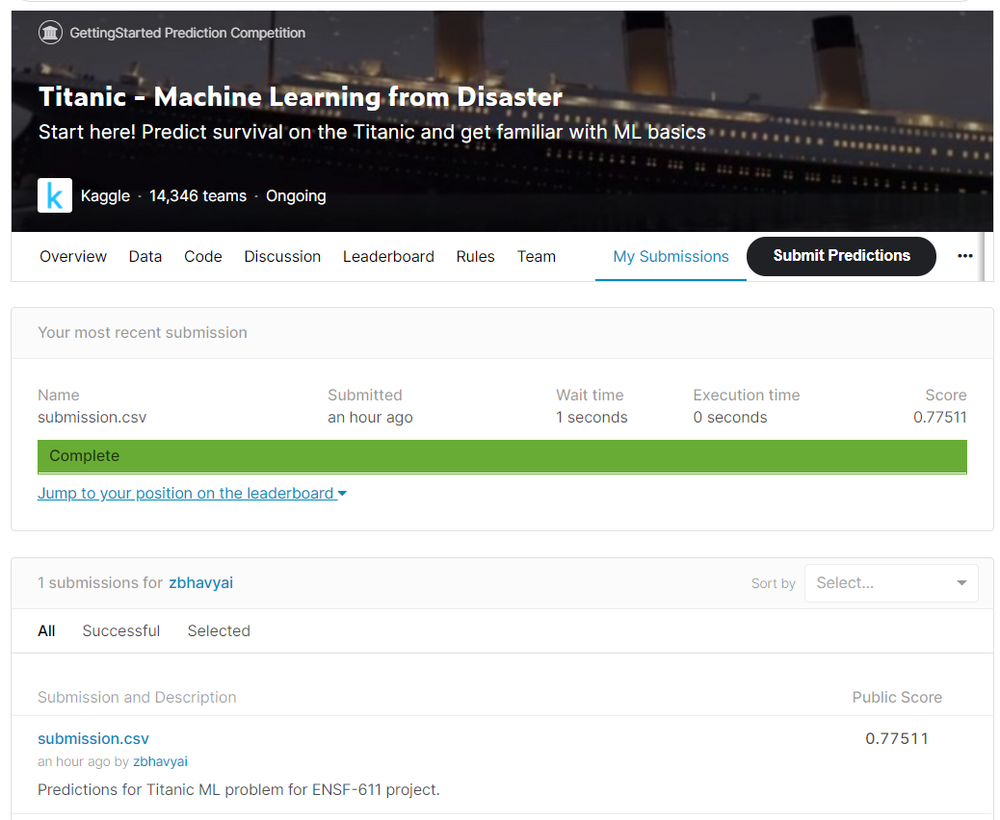

# Project Report

Course: ENSF 611 - Fall 2021

Author: Bhavyai Gupta

## Code files

All the code is available in the file jupyter notebook [titanic.ipynb](titanic.ipynb).

## Running of code

Just run all the cells of the jupyter notebook one by one. At the end, it would generate a file [submission.csv](submission.csv), which was used for submission.

There is no additional packages installed. Only the ones that have been used in the lectures and assignments are used.
- numpy
- pandas
- matplotlib
- seaborn
- mglearn
- sklearn

## Results

The screenshot of the final score as reported after submission on Kaggle is below. The results show that my submission has got accuracy of 0.77511.

## Interpretation

As described in the proposal, I took part in the Titanic competition on Kaggle by preparing the notebook and submitting my predictions.

As stated in the proposal, I had used models LogisticRegression, RandomForest, GradientBoosting, SVC for comparing the initial set of results using Cross Validation. Then hyperparameters were tuned for each of the model using grid search. Finally the best model - RandomForestClassifier - was used to generate the final set of predictions for submission.

However, a second competition on Kaggle wasn't explored, neither XGBoost was explored as time didn't permit.

There were no deviations from proposal.

## Reflection

This was a great learning experience for me. I think for the first time I had to analyze the so many different columns. Also, unlike all other previous assignments, I didn't had access to the `y_test` which made this problem unique for me. 

Speaking of models, I found it surprising that in my case RandomForest performs better than the GradientBoosting and SVC.

It was a fun experience. In future I would go for more Kaggle competitions which would broaden my understanding on Machine Learning.
